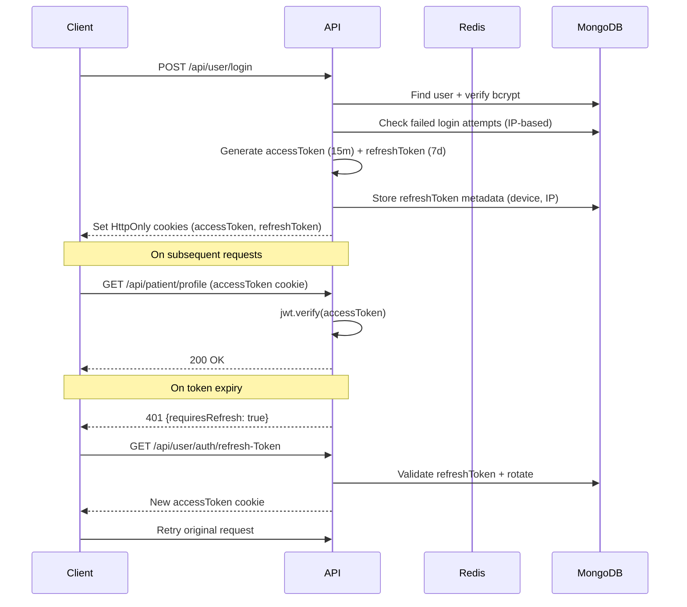
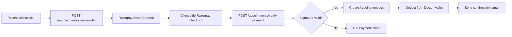
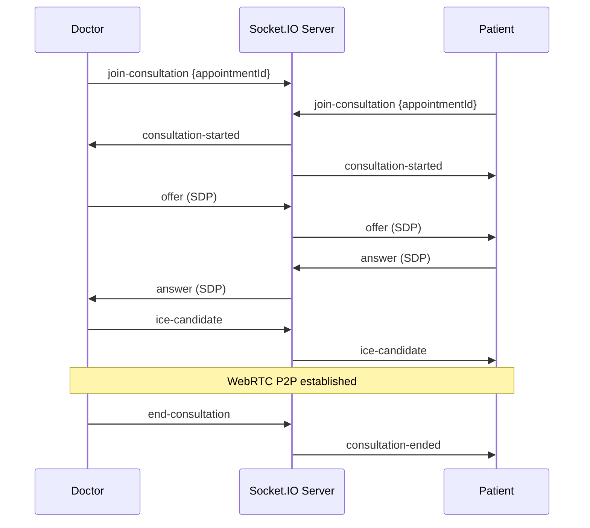

<div align="center">

# 🌸 MedBloom

### *A Full-Stack Healthcare Platform for the Modern Patient-Doctor Experience*

[](https://nodejs.org)
[](https://expressjs.com)
[](https://react.dev)
[](https://mongodb.com)
[](https://redis.io)
[](https://socket.io)
[](https://tailwindcss.com)
[](LICENSE)

**[Live Demo](#) · [Report Bug](https://github.com/your-username/medbloom/issues) · [Request Feature](https://github.com/your-username/medbloom/issues)**

</div>

---

## 📋 Table of Contents

1. [Project Overview](#-project-overview)
2. [Features](#-features)
3. [Tech Stack](#-tech-stack)
4. [Architecture](#-architecture)
5. [Installation & Setup](#-installation--setup)
6. [Environment Variables](#-environment-variables)
7. [API Documentation](#-api-documentation)
8. [Database Design](#-database-design)
9. [Authentication & Security](#-authentication--security)
10. [Performance & Optimization](#-performance--optimization)
11. [Deployment](#-deployment)
12. [Future Improvements](#-future-improvements)
13. [Challenges & Learnings](#-challenges--learnings)
14. [Author](#-author)
15. [License](#-license)

---

## 🎯 Project Overview

**MedBloom** is a production-grade healthcare management platform that bridges the gap between patients and doctors through a seamless digital experience. It handles the full lifecycle of a medical consultation — from doctor discovery and appointment booking to live video consultation, prescription generation, and medical record management.

### The Problem It Solves

Fragmented healthcare tooling forces patients to juggle multiple apps for booking, video calls, and records. Doctors lack a unified workspace to manage their schedule, patient history, and prescriptions in one place. Administrators have no streamlined control panel to verify credentials and oversee platform health.

### Key Differentiators

- **End-to-end consultation lifecycle** — from booking to prescription PDF, all in one flow
- **Real-time WebRTC video calls** with a simultaneous prescription pad for doctors
- **Dual-token security model** (15-min access + 7-day refresh via HttpOnly cookies) with Redis-backed token rotation
- **AI-powered symptom checker** via Google Gemini API for patient pre-triage
- **Integrated wallet system** with Razorpay payment gateway, refunds, and rescheduling
- **Role-gated 3-panel architecture** — distinct, polished dashboards for Patients, Doctors, and Admins

---

## ✨ Features

### 🏥 Core Features
- Multi-role authentication (Patient · Doctor · Admin) with JWT + Google OAuth 2.0
- Doctor onboarding workflow with admin credential review and approval
- Department management with active/inactive status
- Real-time in-app notifications via Socket.IO

### 👤 Patient-Facing Features
- Comprehensive health profile onboarding (blood type, allergies, vitals, lifestyle)
- Public doctor discovery with specialty filtering
- Appointment booking via Razorpay or in-app wallet
- Appointment cancellation with smart refund estimation
- Appointment rescheduling
- Secure medical records vault (upload lab reports, prescriptions, imaging)
- AI symptom checker (Gemini API)
- Wallet top-up and transaction history
- Post-consultation doctor reviews

### 🩺 Doctor-Facing Features
- Dashboard metrics (total patients, appointments, revenue)
- Granular availability scheduling (day-by-week slot engine)
- Live WebRTC video consultation room
- In-call prescription pad (medication · dosage · frequency · duration)
- Instant access to patient medical records during consultation
- Consultation completion with automated prescription PDF generation + email delivery
- Patient list management

### 🛡️ Admin Features
- Doctor application review and approval/rejection workflow
- Block/unblock doctor and patient accounts
- Department CRUD management
- Global appointment and metrics overview
- Admin wallet and revenue tracking
- Enquiry management

### 🔒 Security Features
- Dual-token auth: 15-min access tokens + 7-day refresh tokens in HttpOnly cookies
- IP-based brute-force protection (5 attempts / hour, tracked in MongoDB)
- Rate limiting on auth and payment endpoints (`express-rate-limit`)
- Google OAuth with role-mismatch guard (prevents cross-role account hijacking)
- Session encryption via `connect-mongo` with encrypted session secrets
- `helmet.js` HTTP security headers
- CORS restricted to configured frontend origin

### ⚡ Performance Features
- Redis caching for verification tokens (30-min TTL, replaces DB round-trips)
- `node-cron` automation: 1-hour email reminders + 5-min in-app notifications + auto-complete past appointments via MongoDB `bulkWrite`
- Paginated API responses for medical records, appointments, and patient lists
- Mongoose compound indexes on high-traffic query paths
- Winston structured logging

---

## 🛠 Tech Stack

| Layer | Technology |
|---|---|
| **Frontend** | React 19, Vite 7, TailwindCSS 4, Framer Motion, React Router 7 |
| **UI Components** | Lucide React, Sonner (toasts), React Hook Form, Recharts |
| **Backend** | Node.js 22, Express 5 |
| **Database** | MongoDB 8 (Mongoose 8 ODM) |
| **Cache / Sessions** | Redis 5, connect-mongo |
| **Authentication** | JWT (jsonwebtoken), Passport.js (Google OAuth 2.0), bcrypt |
| **Payments** | Razorpay |
| **File Storage** | Cloudinary (images, PDFs, certificates) |
| **Real-time** | Socket.IO 4 (WebRTC signalling + notifications) |
| **Email** | Nodemailer (transactional: verification, reminders, prescriptions) |
| **AI** | Google Generative AI (Gemini) — symptom analysis |
| **PDF** | PDFKit — prescription PDF generation |
| **Scheduling** | node-cron |
| **Dev Tools** | nodemon, ESLint, Vite HMR |

---

## 🏗 Architecture

### Folder Structure

```
MEDBLOOM/
├── backend/
│   └── src/
│       ├── config/          # DB, Redis, Cloudinary, Passport, Socket.IO, env
│       ├── controller/
│       │   ├── adminControllers/
│       │   ├── patientControllers/
│       │   ├── publicControllers/
│       │   └── userControllers/  # auth, doctor dashboard, patient dashboard, OAuth
│       ├── middlewares/     # authMiddleware, rateLimiter, errorHandler, multer upload
│       ├── model/           # Mongoose schemas
│       ├── routes/          # Express routers (user, patient, doctor, admin, oauth, public)
│       ├── sockets/         # videoCallSocket handler
│       ├── utils/           # email, cron, token service, cloudinary uploader, slot engine
│       ├── app.js           # Express app, middleware chain, route mounting
│       └── server.js        # HTTP server, Socket.IO init, cron init
└── frontend/
    └── src/
        ├── api/             # Axios instance + interceptor, domain API modules
        ├── components/      # Shared UI, layouts, form, profile sub-components
        ├── context/         # AuthContext, NotificationContext
        ├── hooks/           # Custom React hooks
        ├── pages/
        │   ├── admin/       # Auth + Dashboard (doctors, patients, departments, appointments)
        │   ├── consultation/ # VideoConsultationRoom (WebRTC)
        │   ├── landing pages/# Home, About, Services, Find Doctors
        │   ├── patient/     # Public doctor profile
        │   └── user/        # Auth pages, patient dashboard, doctor dashboard
        └── main.jsx
```

### Authentication Flow



### Data Flow — Appointment Booking



### Video Consultation Flow



---

## 🚀 Installation & Setup

### Prerequisites

- Node.js >= 18
- MongoDB (local or Atlas)
- Redis (local or Redis Cloud)
- Cloudinary account
- Razorpay account
- Google OAuth credentials
- Google Gemini API key
- SMTP credentials (Gmail or similar)

### Clone & Install

```bash
# Clone the repository
git clone https://github.com/your-username/medbloom.git
cd medbloom

# Install backend dependencies
cd backend && npm install

# Install frontend dependencies
cd ../frontend && npm install
```

### Run Development Servers

```bash
# Terminal 1 — Backend (port 5000)
cd backend && npm run dev

# Terminal 2 — Frontend (port 5173)
cd frontend && npm run dev
```

---

## 🔐 Environment Variables

### Backend — `backend/.env`

```env
# ── Server ────────────────────────────────────────
PORT=5000
NODE_ENV=development

# ── MongoDB ───────────────────────────────────────
MONGO_URI=mongodb+srv://<user>:<pass>@cluster.mongodb.net/medbloom

# ── Redis ─────────────────────────────────────────
REDIS_HOST=127.0.0.1
REDIS_PORT=6379

# ── JWT ───────────────────────────────────────────
JWT_SECRET=<long-random-secret>
JWT_ACCESS_SECRET=<long-random-secret>
JWT_REFERSH_TOKEN=<long-random-secret>
SALTROUND=10

# ── Sessions ──────────────────────────────────────
SESSION_SECRET=<long-random-secret>
MAX_REFRESH_TOKENS=5

# ── Email (SMTP) ──────────────────────────────────
MAILER_HOST=smtp.gmail.com
MAILER_PORT=587
SERVICE=gmail
SECURE=false
EMAIL_USER=your@gmail.com
EMAIL_PASS=your-app-password

# ── Google OAuth ──────────────────────────────────
GOOGLE_CLIENT_ID=<from Google Cloud Console>
GOOGLE_CLIENT_SECRET=<from Google Cloud Console>

# ── Cloudinary ────────────────────────────────────
CLOUDINARY_NAME=<cloud name>
CLOUDINARY_API_KEY=<api key>
CLOUDINARY_API_SECRET=<api secret>

# ── Razorpay ──────────────────────────────────────
RAZORPAY_KEY_ID=<rzp_live_or_test_key>
RAZORPAY_SECRET_KEY=<razorpay secret>

# ── Google Gemini AI ──────────────────────────────
GEMINI_API_KEY=<from Google AI Studio>

# ── URLs ──────────────────────────────────────────
FRONTEND_URL=http://localhost:5173
BACKEND_URL=http://localhost:5000
```

> **Note:** The server will crash at startup if `MONGO_URI`, `JWT_SECRET`, `JWT_ACCESS_SECRET`, `JWT_REFERSH_TOKEN`, or `SESSION_SECRET` are missing. This is intentional — fail fast in production.

### Frontend — `frontend/.env`

```env
VITE_API_URL=http://localhost:5000/api
```

---

## 📡 API Documentation

All API routes are prefixed with `/api`. Protected routes require valid `accessToken` and `refreshToken` cookies.

### Authentication — `/api/user`

| Method | Endpoint | Auth | Description |
|--------|----------|------|-------------|
| `POST` | `/signup` | ❌ | Register new user |
| `POST` | `/login` | ❌ | Login (Patient/Doctor) |
| `POST` | `/admin/login` | ❌ | Admin login |
| `POST` | `/logout` | ❌ | Clear auth cookies |
| `GET` | `/auth/refresh-Token` | ❌ | Rotate access token |
| `POST` | `/forgot-Password/send-verificationEmail` | ❌ | Trigger password reset |
| `POST` | `/create-new-password` | ❌ | Set new password after reset |
| `POST` | `/change-password` | ✅ | Change password (authenticated) |
| `GET` | `/verify-email/:id/:token` | ❌ | Email verification link handler |
| `GET` | `/context-auth-verify` | ✅ | Validate session and return user context |
| `GET` | `/doctorsData` | ❌ | Public: paginated doctor listing |
| `GET` | `/departments` | ❌ | Public: active departments list |

### Patient — `/api/patient` *(role: patient)*

| Method | Endpoint | Description |
|--------|----------|-------------|
| `POST` | `/onboarding` | Submit health profile (with avatar upload) |
| `GET` | `/profile` | Fetch patient profile + user data |
| `PATCH` | `/edit-profile` | Update profile fields |
| `POST` | `/appointments/create-order` | Razorpay order for booking |
| `POST` | `/appointments/book-wallet` | Book using wallet balance |
| `POST` | `/appointments/verify-payment` | Verify Razorpay signature + confirm booking |
| `PUT` | `/appointments/:id/cancel` | Cancel appointment + trigger refund |
| `GET` | `/appointments/:id/refund-estimate` | Calculate refund based on cancellation window |
| `PUT` | `/appointments/:id/reschedule` | Reschedule to new slot |
| `GET` | `/appointments/:id/consultation-details` | Fetch doctor info for video room |
| `POST` | `/records` | Upload medical record (file + metadata) |
| `GET` | `/records` | Paginated records (filter by category/search) |
| `PUT` | `/records/:id` | Update record metadata |
| `DELETE` | `/records/:id` | Delete record + purge from Cloudinary |
| `GET` | `/wallet/transactions` | Transaction history |
| `POST` | `/wallet/topup/initiate` | Create Razorpay order for wallet top-up |
| `POST` | `/wallet/topup/verify` | Verify top-up and credit wallet |
| `POST` | `/reviews` | Submit post-consultation review |
| `POST` | `/symptom-checker` | AI symptom analysis (Gemini) |

### Doctor — `/api/doctor` *(role: doctor)*

| Method | Endpoint | Description |
|--------|----------|-------------|
| `GET` | `/profile` | Fetch doctor profile |
| `POST` | `/onboarding/basic` | Basic info + avatar upload |
| `POST` | `/onboarding/proffesional` | License, credentials + certificate upload |
| `PATCH` | `/edit-profile` | Update profile fields |
| `GET` | `/Dashboard-Metrics` | Stats: patients, appointments, revenue |
| `GET` | `/appointments` | Doctor's appointments list |
| `GET` | `/patients` | Treated patients list |
| `GET` | `/availability` | Fetch weekly availability slots |
| `PUT` | `/availability` | Update slot availability |
| `PUT` | `/appointments/:id/prescription` | Save prescription for appointment |
| `PUT` | `/appointments/:id/complete` | Complete consultation + generate PDF + email |
| `GET` | `/appointments/:id/patient-records` | View patient's medical records during consult |
| `PATCH` | `/welcome-seen` | Dismiss onboarding welcome notification |

### Admin — `/api/admin` *(role: admin)*

| Method | Endpoint | Description |
|--------|----------|-------------|
| `GET` | `/doctors/pending` | List unapproved doctor applications |
| `GET` | `/doctors/approved` | List approved doctors |
| `PATCH` | `/doctors/:id/approve` | Approve doctor application |
| `PATCH` | `/doctors/:id/reject` | Reject with reason |
| `PATCH` | `/doctor/block/:id` | Block doctor account |
| `PATCH` | `/doctor/unblock/:id` | Unblock doctor account |
| `GET` | `/patients` | All registered patients |
| `GET` | `/Dashboard-Metrics` | Platform-wide KPIs |
| `GET` | `/wallet` | Admin wallet/revenue overview |
| `POST` | `/departemnts/add-new` | Create department |
| `POST` | `/department/edit-info` | Edit department |

---

## 🗄 Database Design

**Database:** MongoDB (chosen for schema flexibility across heterogeneous user roles and rapid feature iteration)

### Collections & Relationships

```
User (auth base)
 ├── role: patient | doctor | admin
 ├── refreshTokens[]  (device, IP, expiry)
 └── failedLoginAttempts[] (timestamp, IP)

Patient → ref User
 ├── vitals (blood type, weight, height, cholesterol)
 ├── lifestyle (smoking, drinking)
 ├── allergies, medicalCondition
 ├── appointments[] → ref Appointment
 └── walletBalance

Doctor → ref User
 ├── professional (specialization, registration, license, certificate)
 ├── consultationFees {online, offline}
 ├── status: pending | approved | rejected | blocked
 ├── appointments[] → ref Appointment
 └── walletBalance

Appointment
 ├── patient → ref Patient
 ├── doctor → ref Doctor
 ├── date, startTime, endTime, mode
 ├── status: pending_payment | confirmed | completed | cancelled | rescheduled
 ├── prescription[] (medication, dosage, frequency, duration)
 ├── prescriptionPdfUrl
 └── isEmailReminderSent

MedicalRecord
 ├── patientId → ref Patient
 ├── appointmentId → ref Appointment (optional, for auto-archived prescriptions)
 ├── category: lab | imaging | prescription | other
 └── fileUrl, fileType, fileSize (Cloudinary)

Transaction
 ├── userId → ref Patient | Doctor | Admin (dynamic ref via refPath)
 ├── type: credit | debit
 ├── paymentGateway: razorpay | system
 └── status: Pending | Success | Failed | Refunded
```

---

## 🔐 Authentication & Security

### Strategy
- **Local auth:** Email + bcrypt-hashed password (`saltRounds=10`)
- **OAuth:** Google OAuth 2.0 via Passport.js with role-binding; prevents cross-role account takeover
- **Session fallback:** Passport sessions backed by MongoDB (`connect-mongo`) for OAuth post-redirect context

### Token Architecture
| Token | TTL | Transport | Storage |
|---|---|---|---|
| Access Token | 15 minutes | HttpOnly cookie | Client cookie jar |
| Refresh Token | 7 days | HttpOnly cookie | MongoDB (hashed metadata) |

- Up to **5 concurrent device sessions** per user (sliding window, oldest evicted)
- Refresh tokens store IP + User-Agent for anomaly detection
- `secure: true` in production, `sameSite: strict` to prevent CSRF

### Brute-Force Protection
- Failed attempts stored per userId + IP in MongoDB (`failedLoginAttempts[]`)
- **5 failures within 1 hour** from same IP triggers 429 lockout
- Cleared on successful login for that IP
- Additional `express-rate-limit` on `/login`, `/signup`, `/forgot-password`, and payment endpoints

---

## ⚡ Performance & Optimization

- **Redis** stores email verification tokens (TTL: 30 min), eliminating DB lookups on the hot verification path
- **Cron jobs** (`node-cron`) run every minute to: send 1-hour email reminders, trigger 5-minute in-app Socket.IO push notifications, and auto-complete past appointments using MongoDB `bulkWrite` (single DB round-trip)
- **Paginated responses** on all list endpoints (records, appointments, patients) with configurable `page` + `limit`
- **Mongoose indexes:** `role` on User, compound `{ userId, createdAt: -1 }` on Transaction for wallet queries
- **Cloudinary** for all binary assets — CDN delivery, responsive transforms
- **Axios interceptor** handles token refresh transparently, queuing and retrying the original request on 401, eliminating duplicate login prompts
- **React lazy routing** — dashboard panels loaded on-demand via URL-driven conditional rendering

---

## 🚢 Deployment

### Recommended Stack
| Service | Provider |
|---|---|
| Backend | Railway / Render / AWS EC2 |
| Frontend | Vercel / Netlify |
| Database | MongoDB Atlas |
| Cache | Redis Cloud / Upstash |
| Files | Cloudinary (already integrated) |

### Production Checklist

```bash
# Frontend — build
cd frontend && npm run build

# Set NODE_ENV=production in backend .env
# Ensure all REQUIRED env vars are present (server throws at startup if missing)
# Set cookie secure: true (automatic when NODE_ENV=production)
# Set FRONTEND_URL to your deployed frontend domain for CORS
# Configure Redis TLS connection string for managed Redis
```

---

## 🗺 Future Improvements

- [ ] Input validation with Zod schema guards on all endpoints
- [ ] TURN server integration for WebRTC NAT traversal in restricted networks
- [ ] Doctor review/publication section
- [ ] PWA push notifications (Web Push API)
- [ ] Admin analytics dashboard with time-series charts
- [ ] Prescription refill requests
- [ ] Multi-language support (i18n)
- [ ] Offline capability with service workers
- [ ] Automated test suite (Jest + Supertest for API, Playwright for E2E)

---

## 🧠 Challenges & Learnings

### WebRTC Signalling Reliability
Implementing a stable peer-to-peer video call required careful ICE candidate buffering — candidates arriving before `setRemoteDescription` are held in a `pendingCandidates` queue and flushed post-handshake, preventing silent connection failures.

### Dual-Token Auth Without localStorage
Storing tokens only in HttpOnly cookies means the frontend has zero direct token access. The Axios interceptor detects `requiresRefresh: true` on 401 responses and silently rotates the token before retrying — all transparent to the UI layer.

### Role-Binding in Google OAuth
Google OAuth must preserve which role (patient/doctor) the user intended to sign up as. The `requestedRole` is stored in the server session (`req.session.oauth_role`) before the OAuth redirect and validated in the Passport callback, preventing a doctor from authenticating into a patient account.

### Prescription → Medical Record Pipeline
When a doctor completes a consultation, the backend generates a PDF with PDFKit, uploads it to Cloudinary as `resource_type: raw`, and creates a `MedicalRecord` entry with `category: prescription` linked to the appointment — ensuring the patient's medical vault is always in sync.

---

## 👨‍💻 Author

**Jithu S Pillai**

[](https://www.linkedin.com/in/jithu-sudharshan-a6168a252/)
[](https://your-portfolio.dev)
[](mailto:jithu.codes@gmail.com)

---

## 🤝 Contributing

```bash
# Branch strategy
main          → production-ready
develop       → integration branch
feature/*     → new features
fix/*         → bug fixes
```

**Commit conventions:** `feat:`, `fix:`, `refactor:`, `docs:`, `chore:`

**PR process:** Fork → feature branch → PR to `develop` → review → merge

---

## 📄 License

This project is licensed under the **MIT License** — see the [LICENSE](LICENSE) file for details.

---

<div align="center">
  <sub>Built with ❤️ by the JithuSudarsan · © 2026</sub>
</div>
